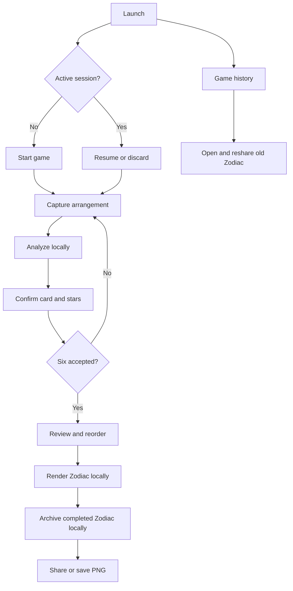

# Zodiac MVP Design

## 1. Objective and assumptions

Build an installable, local-first Svelte SPA that captures six gameplay arrangements, extracts confirmed card and star data, renders a square Zodiac, and hands the PNG to the platform share sheet.

Resolved constraints:

- one supported game in the MVP;
- exactly six captures per completed chart;
- card names are read locally from the printed card in each photograph, not selected from a catalogue;
- red and gold star tokens on a reasonably contrasting play surface;
- an iPhone in portrait orientation as the primary device;
- no server dependency after the app's initial load.

If the game rules differ, adjust the domain model before implementation rather than hiding rules in UI components.

## 2. Scope

### Included

- first-run camera and privacy explanation;
- start, resume, discard, and complete one active session;
- a system camera/photo input that requests the rear camera where supported and permits photo-library fallback;
- image orientation correction, downsampling, and metadata removal;
- assisted detection of red and gold stars, including normalized position and physical size;
- bundled, on-device OCR of the printed card name, with photograph-grounded correction when OCR is uncertain;
- visual review and manual star add/remove/recolor correction;
- capture reorder, retake, and delete;
- deterministic six-sector Zodiac rendering;
- 2048×2048 PNG export;
- native file sharing when supported and save/download fallback;
- install metadata, standalone presentation, safe-area layout, and offline app shell;
- local session recovery after refresh or app termination;
- an on-device completed-game history for reopening, saving, and resharing old Zodiacs.

### Excluded

- accounts, cloud sync, backend storage, or public galleries;
- winner/scoring logic;
- arbitrary games, token shapes, or chart geometries;
- generative image models;
- cloud OCR, photo upload, or recognition of unsupported card layouts;
- cloud-synced history, public galleries, history search, or cross-device recovery;
- localization, alternate art themes, and print ordering;
- background processing after the app is closed.

## 3. User flow



Each accepted capture is persisted before the app returns to the camera. The user never has to keep the camera stream alive while reviewing or generating.

## 4. Proposed architecture

Use SvelteKit in static SPA mode rather than a hand-assembled Svelte/Vite shell. It provides routing and first-party service-worker integration while still producing a deployable client-only application.

```text
Svelte screens and session store
        │
        ├── Capture adapter ── system camera / photo input
        ├── Image pipeline ── normalize → local OCR + token detection → corrections
        ├── Session repository ── IndexedDB blobs + structured records
        ├── Zodiac renderer ── Canvas 2D → PNG Blob
        └── Share adapter ── navigator.share / save fallback

Service worker ── versioned app-shell and static-asset cache only
Web manifest ── icon, theme, start URL, standalone display
```

### Suggested module boundaries

```text
src/
  lib/
    domain/       session types, validation, capture ordering
    image/        capture normalization and EXIF removal
    vision/       segmentation, contours, position, size, confidence
    ocr/          bundled Tesseract worker, engine, English data, card crop
    persistence/  IndexedDB repository and migrations
    render/       deterministic chart layout and PNG export
    share/        capability detection and platform fallbacks
    components/   reusable controls and feedback
  routes/         start, capture, review, generate, result
  service-worker.ts
static/
  manifest.webmanifest
  icons/
  art/            renderer textures and fonts with explicit licenses
```

Domain and rendering modules should not depend on Svelte. This makes the important transformations testable with fixture images.

## 5. Data model

```ts
type StarColor = 'gold' | 'red';

interface Point {
  x: number; // normalized 0..1 inside the detected arrangement bounds
  y: number; // normalized 0..1
}

interface DetectedStar {
  id: string;
  color: StarColor;
  position: Point;
  size: number; // normalized token diameter, reproduced by the renderer
  confidence: number;
  correctedByUser: boolean;
}

interface Capture {
  id: string;
  order: number;
  cardLabel: string;
  imageBlobKey: string;
  thumbnailBlobKey: string;
  stars: DetectedStar[];
  acceptedAt: string;
}

interface GameSession {
  schemaVersion: 1;
  id: string;
  createdAt: string;
  updatedAt: string;
  status: 'capturing' | 'reviewing' | 'complete';
  captures: Capture[];
  outputBlobKey?: string;
}

interface GameHistoryEntry {
  schemaVersion: 1;
  id: string;
  createdAt: string;
  completedAt: string;
  cardLabels: string[];
  goldCount: number;
  redCount: number;
  output: Blob;
}
```

Persist records and sanitized blobs in IndexedDB. Never store base64 images in localStorage. Request persistent storage where supported, but design recovery messaging on the assumption that the browser can still evict data.

Only one active capture session is retained. Completion atomically updates that active result and an idempotent history entry. Starting another game deletes the prior working photographs but preserves the compact history record and final PNG. A version-2 IndexedDB migration creates the history store without disturbing a version-1 active session; a legacy completed active session is backfilled on first launch.

## 6. Image-processing pipeline

### 6.1 Normalize

1. Decode the captured image and apply its orientation.
2. Draw it into a canvas, removing source metadata such as EXIF and GPS.
3. Downsample the long edge to a working resolution around 1600 px; create a smaller thumbnail.
4. Preserve the clean normalized blob until the session is discarded so the user can revisit corrections.

### 6.2 Find the play region

The capture guide encourages the card and tokens to occupy a predictable region, but analysis must use the captured frame rather than assume exact alignment. Begin with a generous region of interest above the card. A later refinement may detect the light card rectangle to establish scale and orientation.

### 6.3 Detect stars

For the known red and gold pieces:

1. Convert sampled pixels from RGB to HSV/HSL-like channels.
2. Apply calibrated color ranges with tolerance for warm indoor light.
3. Clean masks using simple morphology.
4. find connected components/contours;
5. reject candidates outside expected area, size, solidity, and approximate five-point shape bounds;
6. classify red/gold, calculate a centroid and bounding diameter, and normalize coordinates and token size to the arrangement bounds;
7. assign confidence from color separation, contour quality, and overlap with the guide.

The first technical spike should compare a small purpose-built implementation with OpenCV.js. Prefer the smaller option if it meets fixture accuracy and runtime targets; do not commit a large computer-vision dependency by assumption.

Card recognition locates the bright printed card in the lower photograph, crops its interior, increases text contrast, and runs bundled English Tesseract data entirely on device. The recognized uppercase name populates the review field. If recognition is uncertain, the user may correct the field only while the source photograph remains visible; the photograph is authoritative and there is no catalogue or filename-derived label.

### 6.4 Review and correct

Overlay every detected star on the photo. Low-confidence candidates are visibly marked. A compact editor supports:

- tap empty space to add a star;
- tap a star to switch red/gold or delete it;
- correct the OCR-derived card label against the visible printed card;
- retake the photograph.

The structured data, not the overlay, is the source of truth for the final chart.

### 6.5 Render

Render at a fixed 2048×2048 logical canvas:

1. paint the navy star-field background from licensed local texture/procedural noise;
2. draw outer rings, six radial dividers, and ornament in warm gold;
3. place sector labels along the ring in capture order;
4. map each capture's normalized positions into a roomy outer band of its wedge, leaving the center visually open;
5. draw restrained red/gold star glyphs using each token's normalized recorded size, clamped only to maintain legibility and sector spacing;
6. convert the canvas to a PNG blob.

The same session data must always generate the same chart for a given renderer version. Keep the renderer version with the output record for reproducibility.

## 7. PWA and offline behavior

- Serve production over HTTPS; camera, sharing, and service-worker features are secure-context capabilities.
- Provide a web app manifest with app name, icons, theme/background colors, `start_url`, and `display: "standalone"`. Treat `fullscreen` as a tested enhancement, not a dependency; standalone retains clearer system affordances.
- Include iOS-compatible Home Screen icons and status-bar metadata.
- Precache only the versioned application shell, local fonts, icons, and small renderer assets. Session photos belong in IndexedDB, not Cache Storage.
- Allow an in-progress game to complete offline after the first successful application load.
- Surface an update only between sessions. Never force a service-worker activation while a capture session is active.
- Show short contextual “Add to Home Screen” guidance in Safari, dismissible forever; do not block browser use.

SvelteKit automatically bundles and registers `src/service-worker.*`, but production update behavior and cache invalidation still require explicit tests.

## 8. Camera and sharing adapters

### Capture

Use `<input type="file" accept="image/*" capture="environment">` only after the user taps the shutter. On supporting iPhones this opens the system rear-camera capture path; the same control can select an existing photograph. Delegating capture to the operating system avoids a long-lived media stream and its Home Screen lifecycle risks. A custom `getUserMedia()` view is a post-MVP enhancement, not a dependency.

### Sharing

Create a `File` from the PNG blob, then call `navigator.canShare({ files: [file] })` before exposing the primary file-share action. `navigator.share()` must run directly from a user gesture. If unavailable or rejected for capability reasons, offer a browser-safe download/open-image path; cancellation returns quietly to the result screen.

## 9. Privacy and security

- Process locally; make no image or recognition network requests.
- Re-encode captures before persistence so embedded camera metadata is not retained.
- Do not request location, microphone, contacts, notifications, or authentication.
- Use a restrictive Content Security Policy compatible with local workers and blobs.
- Never place captures or output URLs in logs, analytics, error reports, or route parameters.
- Revoke object URLs and stop camera tracks promptly.
- Provide a visible “Discard game” action that deletes the active capture session and its working photo blobs without silently deleting completed history.

## 10. Functional acceptance criteria

### Capture and recovery

- A user can grant camera permission, take a photo, review it, and accept it on a current iPhone.
- Denied camera access leads to a usable file-input fallback without a dead end.
- Orientation is correct for portrait and landscape source photos.
- Reloading or closing after any accepted capture restores the complete active session.
- No persisted normalized capture contains the input file's EXIF/GPS metadata.

### Recognition and correction

- On an agreed fixture set representing normal indoor play, at least 95% of clearly visible star tokens are correctly classified by color and no fixture has an uncorrectable result.
- The app never silently finalizes a low-confidence capture.
- Users can add, delete, and recolor a star and correct the photograph-derived card label without retaking.
- Fewer/more than six accepted captures are explained before generation.

### Rendering and sharing

- Six accepted captures produce a valid 2048×2048 PNG with six readable photo-derived labels and the confirmed star count, color distribution, relative positions, and visibly preserved token sizes.
- Output is visually stable across current iPhone Safari/Home Screen mode and desktop reference browsers.
- A supported iPhone opens the native share sheet with the PNG attached from one result-screen tap.
- Unsupported file sharing exposes a working save/download fallback.
- Every completed Zodiac appears in local Game history after starting another game or relaunching the app.
- A historical Zodiac retains its date, six card labels, color totals, original 2048×2048 PNG, and working share/save actions without retaining its six source photos.

### Offline and installation

- After one online load, a returning user can launch, capture, review, render, and reach a save path in airplane mode.
- The Home Screen launch uses the intended icon, theme, safe areas, and standalone presentation.
- A new deployment cannot discard or corrupt an active version-1 session.

### Accessibility and performance

- Primary controls meet a minimum 44×44 CSS pixel target, support VoiceOver labels, and do not rely on color alone.
- Text and controls meet WCAG AA contrast; reduced-motion preferences remove nonessential star animation.
- Camera-ready interaction appears within two seconds after permission on target devices, analysis completes in two seconds per fixture photo at the working resolution, and PNG rendering completes in three seconds on the oldest supported iPhone. Final device thresholds should be validated during the spike.

## 11. Test strategy

- Unit tests: coordinate transforms, color classification, session validation, sector mapping, renderer determinism, data migrations.
- Golden-image tests: fixed session JSON compared with approved render snapshots within a defined pixel tolerance.
- Fixture tests: varied lighting, shadows, wood tones, rotated cards, partially close pieces, and both example images.
- Component tests: capture-review corrections, active restore, completed-history recovery/reshare, destructive confirmations, offline/update notices.
- Real-device tests: at minimum the oldest supported iPhone, a current iPhone, Safari tab mode, Home Screen mode, denied permissions, low storage, offline launch, and share-sheet cancellation.
- Privacy check: inspect stored blobs and all network traffic during a complete session.

## 12. Delivery sequence

1. **Technical spike:** prove camera lifecycle, offline Home Screen launch, file sharing, EXIF removal, and star detection on a fixture set.
2. **Vertical slice:** one capture through manual confirmation into one rendered sector and shared PNG.
3. **Session MVP:** six captures, IndexedDB recovery, reorder/retake/delete, complete renderer.
4. **Resilience:** correction editor, permission fallbacks, service-worker updates, error states, accessibility.
5. **Product validation:** moderated games against the success measures in `VISION.md`, followed by a scope decision.

Do not begin visual polish beyond the vertical slice until the technical spike demonstrates reliable camera, persistence, and export behavior on a real Home Screen installation.

## 13. Remaining product decisions

- Final supported iOS range and oldest test device
- Whether sector order follows capture time, game-defined order, or manual order
- Whether the artwork date/title belongs inside the exported image
- Licensed production typefaces, texture, and ornament assets

## 14. Implementation references

- [SvelteKit service workers](https://svelte.dev/docs/kit/service-workers)
- [MDN Service Worker API](https://developer.mozilla.org/en-US/docs/Web/API/Service_Worker_API)
- [WebKit Home Screen web-app behavior](https://webkit.org/blog/17333/webkit-features-in-safari-26-0/)
- [MDN `getUserMedia()`](https://developer.mozilla.org/en-US/docs/Web/API/MediaDevices/getUserMedia)
- [MDN `navigator.share()`](https://developer.mozilla.org/en-US/docs/Web/API/Navigator/share)
- [MDN persistent storage](https://developer.mozilla.org/en-US/docs/Web/API/StorageManager/persist)
