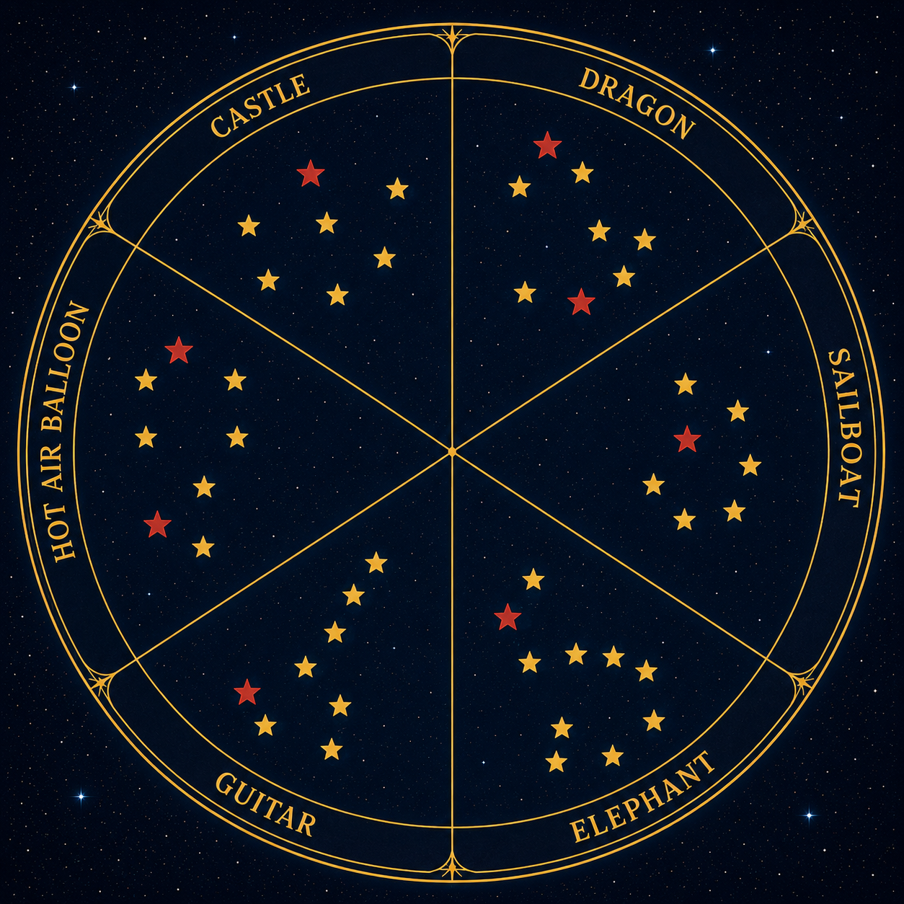

# Zodiac

Zodiac turns the end state of a tabletop game into a personal constellation chart: photograph each card and its stars during play, then export one square image that remembers the whole game.

> **Status:** MVP implemented and under iterative field-photo review. Pull requests provide deployed review builds, fixtures, tests, and current product documentation.



## The MVP in one minute

1. Open Zodiac from an iPhone Home Screen and start a game.
2. Photograph each of the six card-and-star arrangements.
3. Zodiac rotates the scene so the card is above the constellation, reads its six numbered words and the black die, and places only the die-selected word in the confirmation field.
4. Review the six captures and generate the chart.
5. Share the resulting PNG through the iOS share sheet or save it.
6. Reopen any completed game from local Game history and share it again later.

The proposed MVP is local-first. Photos, recognition results, and finished charts remain on the device unless the user explicitly shares them. Chart creation is deterministic canvas rendering, not generative AI, so the output accurately reflects the pieces in the photographs and works offline after the app shell has been cached.

## Product documents

- [VISION.md](VISION.md) defines the promise, audience, principles, boundaries, and measures of success.
- [MVP_DESIGN.md](MVP_DESIGN.md) proposes scope, architecture, data model, processing pipeline, acceptance criteria, and delivery plan.
- [UX_DESIGN.md](UX_DESIGN.md) specifies the mobile journey, screens, states, accessibility, and visual direction, with generated mock-ups.
- [IMPLEMENTATION_PLAN.md](IMPLEMENTATION_PLAN.md) records the implemented architecture, delivery phases, and acceptance gates.
- [E2E_GUIDE.md](E2E_GUIDE.md) defines the executable-documentation and zero-pixel visual testing policy.
- [PROMPTS.md](PROMPTS.md) records project prompts from the project owner verbatim.

## Existing reference material

- `assets/examples/example1.jpg` and `assets/examples/example2.jpg` are metadata-free copies of the representative iPhone gameplay captures. The original camera files remain local and untracked.
- `zodiac.png` is the reference for the square shareable output.
- `assets/ux/` contains product mock-ups; these communicate direction rather than pixel-perfect implementation.

## Proposed implementation

- SvelteKit rendered as a client-side SPA and deployed as static assets over HTTPS
- TypeScript for domain and image-processing code
- Local Tesseract OCR for reading all six blue card words plus the upward white die number, then selecting the corresponding word
- Canvas 2D for metadata-stripping normalization, token detection, analysis overlays, and final 2048×2048 PNG rendering
- IndexedDB for the active session, sanitized image blobs, and a local completed-game history
- Web App Manifest plus a SvelteKit service worker for Home Screen/standalone presentation and offline app-shell caching
- a system camera/photo input with `capture="environment"`, which opens the rear-camera path on supporting iPhones and remains compatible with the photo picker
- Web Share API file sharing, feature-detected with a save/download fallback

No backend, account, analytics, or photo upload is required for the MVP.

## Resolved MVP decisions

- The MVP is for a six-card game and produces exactly six sectors.
- Every card has six gold-numbered blue words; its black die chooses the sole word used as the sector label. A correction field remains beside the photograph only to fix recognition mistakes.
- Token color and relative position are recorded. Constellations are uniformly expanded to a common sector span, with one consistent output size for every gold star and another for every red star.
- The `zodiac.png` square art direction is approved.
- Local-only processing is a requirement, including OCR and token detection. The app makes no photo or recognition request to a server.

## Development

```sh
npm install
npm run dev
```

Production and verification commands:

```sh
npm run check
npm run build
npm run test:unit
npm run test:e2e
```

The Playwright suite uses six AI-generated, photorealistic gameplay fixtures in `tests/e2e/fixtures/`. It performs a complete start-to-share-and-reshare run, validates the 2048×2048 output, completed-game history, reload recovery, phone/desktop presentation, manifest metadata, touch targets, and offline OCR. See [E2E_GUIDE.md](E2E_GUIDE.md) before changing UI or tests.

Fourteen real iPhone photographs form the recognition regression corpus in `tests/fixtures/real/`. Run `npm run dev` and open `/fixtures` to review their editable text regions, card-defined north vectors, and token circles. The browser E2E suite processes every image and compares local recognition with those records. See [FIXTURE_GUIDE.md](FIXTURE_GUIDE.md) for the schema and review workflow.

Twelve additional metadata-free iPhone fixtures in `tests/fixtures/issues/` cover the production six-word card, black-die selection, missing-card rejection, quarter-turn capture, exact upside-down capture, and a complete rotation-safe Zodiac.

## Deployment previews

Every pull request is verified and deployed to a retained GitHub Pages directory at `https://anicolao.github.io/zodiac/pr<PR number>/`. The workflow creates or updates one comment on the pull request with its exact preview URL. A merge to `main` publishes the production build at `https://anicolao.github.io/zodiac/` while retaining existing PR previews.

Every screen also shows the running Git revision as a short `Build abc12345` marker. Zodiac checks a cache-busted `build.json` manifest against the full embedded revision: **Current** confirms an online match, **Offline** means the comparison came from the local cache, and **Update available** identifies a newer deployment. At a safe stopping point, **Update available · Refresh** activates the waiting service worker and reloads with its own cache-busting build URL; no hand-edited query string is required.

## Technical references

- [SvelteKit service workers](https://svelte.dev/docs/kit/service-workers)
- [WebKit: Home Screen web apps on iOS 26](https://webkit.org/blog/17333/webkit-features-in-safari-26-0/)
- [MDN: Web Share API](https://developer.mozilla.org/en-US/docs/Web/API/Navigator/share)
- [MDN: camera access](https://developer.mozilla.org/en-US/docs/Web/API/MediaDevices/getUserMedia)
- [MDN: web app manifest display modes](https://developer.mozilla.org/en-US/docs/Web/Progressive_web_apps/Manifest/Reference/display)
