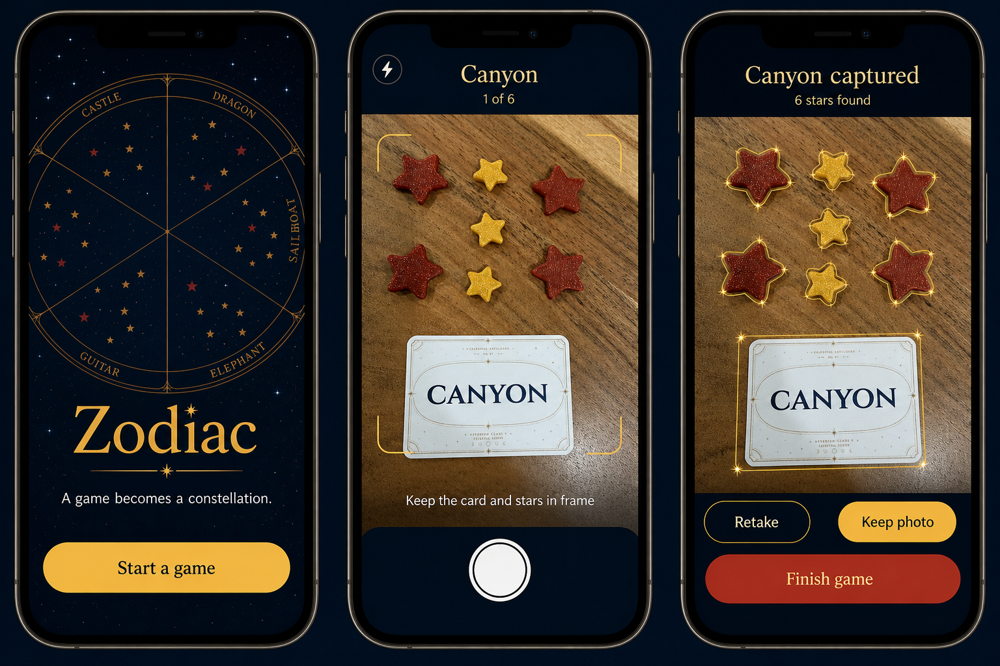
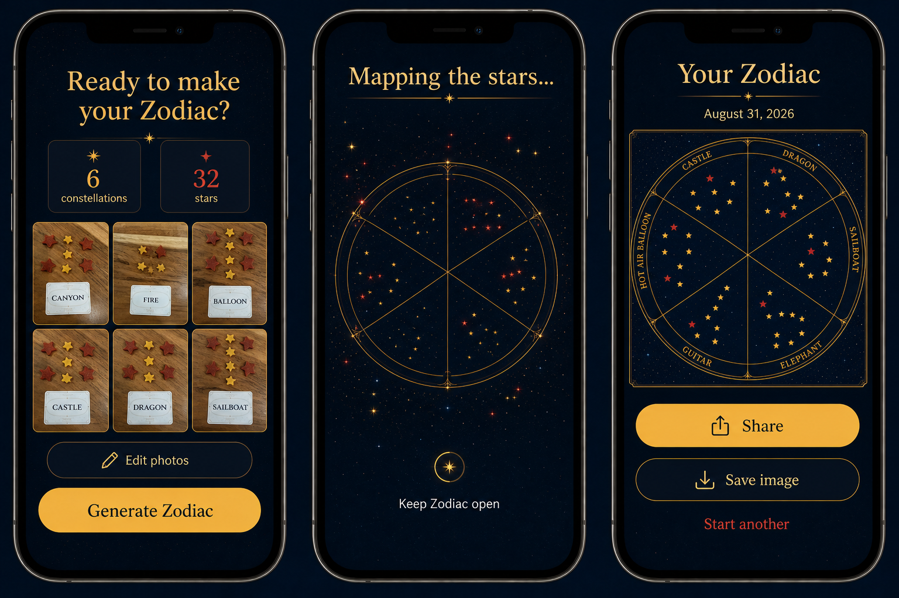

# Zodiac UX Design

## 1. Experience summary

Zodiac is a brief ritual wrapped around a tabletop game. During play, it behaves like a forgiving camera. After play, it becomes a quiet editor and then a reveal. The interface should never compete with the physical game or make the user manage technical concepts such as “computer vision,” “uploads,” or “rendering.”

The primary path is:

```text
Start game → Capture × 6 → Confirm → Review → Generate → Share
```

An active session always resumes where it left off. There is no account, app-level navigation bar, feed, or settings hierarchy in the MVP.

## 2. Design principles

- **One dominant action per screen.** The camera shutter, Keep photo, Generate Zodiac, and Share actions are visually unmistakable.
- **Fast during play, precise afterward.** A confident capture can be accepted immediately; uncertain details can be corrected without losing the photo.
- **Show the app's work.** Detection outlines make the translation from pieces to chart understandable.
- **Use magic as atmosphere, not ambiguity.** Celestial motion supports transitions, while labels and status use plain language.
- **Preserve escape routes.** Retake, manual edit, camera fallback, save fallback, resume, and discard are always reachable at the moment they matter.
- **Design for one hand.** Frequent actions sit in the lower thumb zone and respect iPhone safe areas.

## 3. Information architecture

| Area | Purpose | Persists? |
|---|---|---:|
| Welcome | Explain the promise and start/resume | App shell |
| Capture | Frame and photograph one arrangement | Until accepted |
| Confirm | Verify card and star detection | Session |
| Session review | See, reorder, edit, or retake six captures | Session |
| Generation | Communicate short local processing | Transient |
| Result | Preview, share, save, or start again | Session |
| Install help | Explain Safari Home Screen steps contextually | Dismissal only |

## 4. Mock-ups

These generated boards establish hierarchy, color, and tone. They are not literal implementation screenshots: native browser/camera behavior, safe areas, dynamic type, exact copy, and correction states must be implemented and tested independently.

### Start, capture, and confirmation



Design takeaways:

- The welcome screen previews the reward before asking for commitment.
- The camera keeps progress, flash, guidance, and shutter visible without covering the game pieces.
- Confirmation outlines every interpreted object and gives Retake equal clarity without making it the dominant action.
- The red Finish game treatment in the mock-up should not ship as shown; finishing is not destructive. In implementation it should be a calm secondary action and remain disabled/explained until six valid captures exist.

### Review, generation, and share



Design takeaways:

- The review screen answers “did I get everything?” with thumbnails and totals.
- Generation provides a short, determinate stage where possible; it never pretends to continue after the app closes.
- The result keeps the entire square artwork visible and makes the platform share sheet the primary route.
- The generated board's card names are illustrative. Production labels come only from confirmed session data.

## 5. Detailed screen specification

### 5.1 Welcome / resume

**New user**

- Product name and line: “A game becomes a constellation.”
- Small preview of the finished chart, decorative and noninteractive.
- Primary: **Start a game**.
- Secondary install hint appears only in eligible Safari browser context: **Add Zodiac to Home Screen**.
- A compact privacy statement before first camera use: “Photos stay on this device unless you share your Zodiac.”

**Returning user with active session**

- Replace the start CTA with **Resume game · 3 of 6**.
- Secondary: **Start over**, followed by a destructive confirmation that describes what will be erased.

Do not request camera permission on launch. Ask after the user chooses to capture, when the reason is evident.

### 5.2 Camera

- Header: confirmed/suggested card name when known and progress such as **1 of 6**.
- Live rear-camera image fills available space between safe-area header and bottom controls.
- A simple corner guide asks the user to keep the card and all stars visible; it is guidance, not a hard crop.
- One sentence changes responsively: “Move closer,” “More light needed,” “Hold steady,” or “Ready.”
- Controls: flash/torch only when supported, library/fallback entry, and a large shutter.
- Primary shutter has an accessible name: “Take photo for constellation 1 of 6.”
- Stop the camera on navigation, lock, interruption, or backgrounding; provide a clear resume action rather than a frozen preview.

### 5.3 Analysis

The captured frame replaces the live camera immediately. A short local-processing state uses “Finding stars…” and a subtle sweep or twinkle. If analysis exceeds two seconds, add “This stays on your device.” Never show fake percent precision.

### 5.4 Confirm capture

- Display the normalized photo with gold/red outlines or numbered pins on detected stars.
- Show the locally recognized printed card name in an editable field beside the photograph. Corrections must be grounded in the visible card; names are never suggested from filenames or a catalogue.
- State a plain result: **6 stars found**.
- If confidence is high, primary **Keep photo** and secondary **Retake**.
- If confidence is low, use **Check stars** as the primary action and explain the affected item: “One star may be hidden.”
- **Edit stars** opens the direct manipulation mode described below.
- After keeping, give a brief haptic-like visual confirmation and return directly to the next camera; do not add a redundant success screen.

### 5.5 Star editor

- Tapping an outlined star opens a small, reachable choice: Gold, Red, Delete.
- Tapping empty photo space adds a star and immediately asks Gold or Red.
- Each star has shape/icon plus color so correction does not rely only on hue.
- Undo remains visible until save.
- Detection outlines scale with the measured token size, making the size translation inspectable before generation.
- Primary: **Save corrections**; secondary: **Cancel** restores the last accepted structured data.
- Pinch zoom may help but cannot be required; provide zoom buttons for accessibility.

### 5.6 Session review

- Title: **Ready to make your Zodiac?**
- Six thumbnails with order, card name, and star count. Any warning appears on the specific capture.
- Summary totals by star color, using icon + label.
- Tap a tile to edit, retake, delete, or change label.
- Reorder through an explicit **Reorder** mode with up/down alternatives to drag and drop.
- Primary **Generate Zodiac** becomes available only with six valid, uniquely identified captures. Disabled state explains the missing requirement next to the button.

### 5.7 Generation

- Use captured points that settle into six wedges as a lightweight visual bridge from game to keepsake.
- Copy: **Mapping the stars…** and **Keep Zodiac open**.
- Prefer a short determinate progress bar based on completed render stages; use an indeterminate indicator only if timing is genuinely unknown.
- Respect `prefers-reduced-motion` by replacing movement with a static chart and status changes.
- If generation fails, preserve the session and offer **Try again** plus **Return to review**.

### 5.8 Result and sharing

- Title: **Your Zodiac** with the game date outside the exported image unless product review decides otherwise.
- Show the complete 1:1 image without cropping. Tap opens a zoomable preview.
- Primary **Share** invokes the native share sheet with the PNG file.
- Secondary **Save image** uses the best supported fallback.
- Tertiary **Start another** requires confirmation only because it replaces the current session.
- A successful share does not claim that a destination completed an upload; return to the result and let the platform own completion feedback.

## 6. Installation and standalone behavior

Browser use remains fully functional. Home Screen installation is an enhancement for repeat play.

- In eligible iPhone Safari context, offer a dismissible instruction card after the welcome has rendered, not a blocking modal.
- Use current platform language and a simple two-step visual: Share → Add to Home Screen.
- Once running in standalone display mode, remove install guidance.
- Respect safe-area insets on every edge and avoid controls beneath the home indicator.
- Keep the screen awake only if a broadly supported, permission-appropriate approach is proven; the MVP must recover cleanly from normal lock instead.
- Do not call the experience “installed” until display-mode detection confirms it.

## 7. States and recovery

| Situation | User-facing response |
|---|---|
| Camera permission denied | Explain how to allow it and offer Take/Choose Photo fallback |
| Camera interrupted | Freeze no stale frame; show **Resume camera** |
| Photo too dark/blurred | Keep the photo visible; recommend retake but allow manual correction |
| No stars found | “We couldn't find the stars.” Offer edit and retake |
| Some stars uncertain | Highlight only uncertain items and open Check stars |
| Duplicate card label | Identify both captures; choose a different label or confirm if rules allow |
| App closes mid-game | Resume from the last accepted capture; unaccepted camera frames may be lost |
| Storage write fails | Keep current data in memory, stop new capture, offer export/retry, never imply it was saved |
| Offline | No warning if all core features work; small status only when an unavailable action is attempted |
| Share unsupported | Replace primary action with **Save image** and explain how to share from Photos/Files |
| Share cancelled | Return silently to the unchanged result screen |
| New app version | Offer refresh after session completion; defer during capture |

## 8. Visual system

### Color roles

| Role | Direction | Use |
|---|---|---|
| Night | `#031426` vicinity | Primary background and exported sky |
| Deep night | Near-black navy | Camera chrome and depth |
| Constellation gold | `#F3B83F` vicinity | Primary action, lines, gold stars |
| Ember red | `#D83B2D` vicinity | Red stars and warnings only |
| Ivory | Warm off-white | Body text and card references |

Exact tokens must be derived with contrast testing; mock-up colors are directional.

### Typography

- A licensed, high-contrast serif may carry the product name, chart labels, and reveal moments.
- System sans-serif carries controls, guidance, status, and small values.
- Never render operational controls in ornate lettering at the cost of legibility.
- Support Dynamic Type-like scaling using rem-based type, reflow, and no fixed-height text containers.

### Shape and motion

- Thin circular rules and restrained four/eight-point ornaments echo the output.
- Controls use generous rounded rectangles; the camera shutter retains a familiar circular silhouette.
- Motion is sparse: a short capture flash, detection appearance, and generation transition. No looping decorative animation during camera use.

## 9. Accessibility requirements

- 44×44 CSS pixel minimum targets with separation around destructive actions.
- WCAG AA contrast for text and essential controls.
- Visible focus treatment and complete keyboard operation for desktop testing.
- VoiceOver order follows visual hierarchy; live capture instructions use a polite live region and do not chatter continuously.
- Every colored star also has a label/shape distinction in editor and summaries.
- Reduced motion, increased text size, landscape rotation, and high contrast must not hide primary actions.
- Canvas output has a nearby text summary such as “Six constellations, 32 stars: 24 gold and 8 red.” The shareable PNG itself remains visual.

## 10. Content style

Use short, warm, literal language.

- Prefer “6 stars found” to “Analysis successful.”
- Prefer “Keep photo” to “Confirm detection result.”
- Prefer “We couldn't find the stars” to an error code.
- Say “on this device” only where it builds privacy confidence; do not repeat it on every screen.
- Do not call the generated image “AI art.” It is the player's confirmed game rendered as a chart.

## 11. Usability validation

Test the complete flow around a real table, not only at a desk. Observe:

- whether players remember when to take each photo;
- whether a capture can be completed without moving pieces unnecessarily;
- whether the guide produces analyzable photos under common warm lighting;
- whether users understand outlines and can correct one bad detection;
- whether “Finish game” versus “Generate Zodiac” is conceptually clear;
- whether the result feels accurate and worth sharing;
- whether Home Screen installation adds value or merely adds instruction.

The first prototype should be tested with paper/static screens for hierarchy and a functional camera/detection slice for the hard interaction. A static mock-up cannot validate camera lifecycle, recognition, or the iOS share sheet.

## 12. Mock-up provenance

The boards in `assets/ux/` were generated with the built-in image-generation tool using `zodiac.png` as the finished-art reference, the two gameplay photographs now published as metadata-free copies in `assets/examples/`, and the first board as a style reference for the second. The exact production prompts are preserved in `assets/ux/IMAGEGEN_PROMPTS.md`.
