# Complete local Zodiac journey

Six realistic gameplay photographs are read locally, confirmed, composed into the approved Zodiac artwork, persisted, and handed to the platform share action.

## The private six-photo ritual starts with the approved celestial art direction

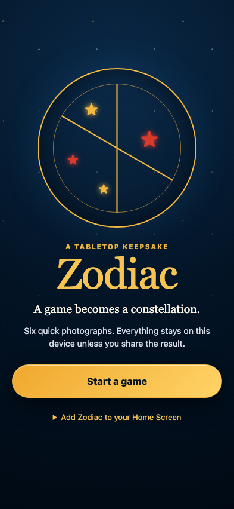

**Verifications:**

- [x] The app has a stable accessible title
- [x] The promise and local-only privacy statement are visible
- [x] The first action is touch-sized and named

## CASTLE is read from its printed card and its sized tokens are found

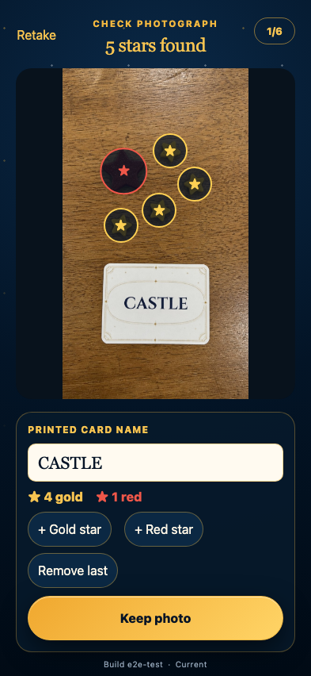

**Verifications:**

- [x] OCR reads CASTLE from the fixture rather than filename or test input
- [x] 4 small gold stars are detected
- [x] 1 larger red stars are detected
- [x] Every detected token has a positive recorded display size

## DRAGON is read from its printed card and its sized tokens are found

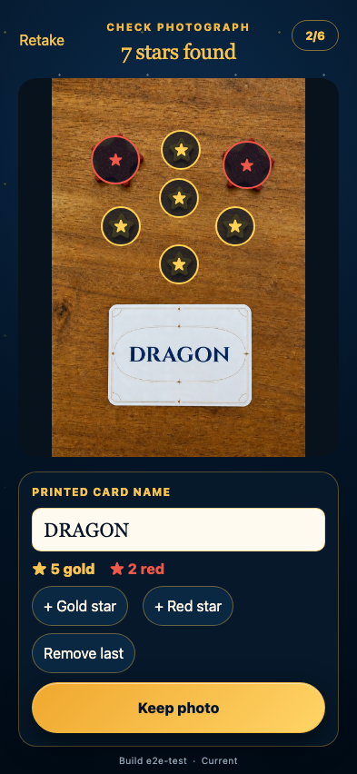

**Verifications:**

- [x] OCR reads DRAGON from the fixture rather than filename or test input
- [x] 5 small gold stars are detected
- [x] 2 larger red stars are detected
- [x] Every detected token has a positive recorded display size

## SAILBOAT is read from its printed card and its sized tokens are found

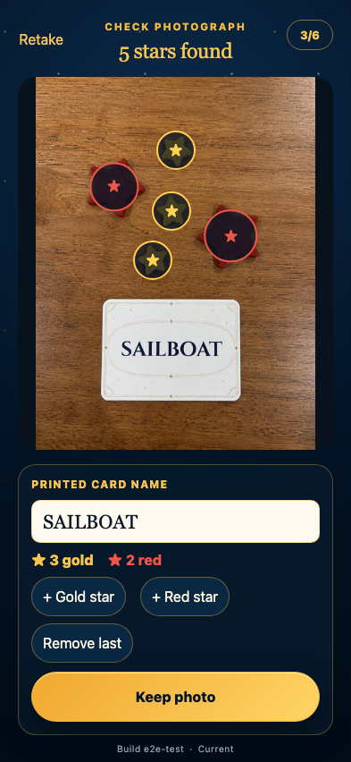

**Verifications:**

- [x] OCR reads SAILBOAT from the fixture rather than filename or test input
- [x] 3 small gold stars are detected
- [x] 2 larger red stars are detected
- [x] Every detected token has a positive recorded display size

## ELEPHANT is read from its printed card and its sized tokens are found

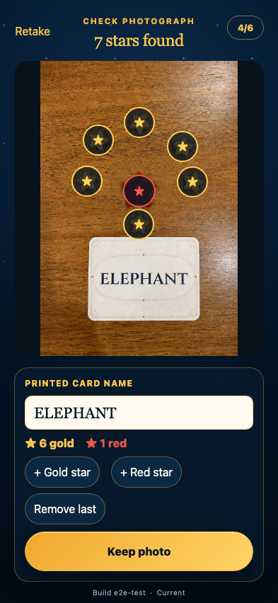

**Verifications:**

- [x] OCR reads ELEPHANT from the fixture rather than filename or test input
- [x] 6 small gold stars are detected
- [x] 1 larger red stars are detected
- [x] Every detected token has a positive recorded display size

## GUITAR is read from its printed card and its sized tokens are found

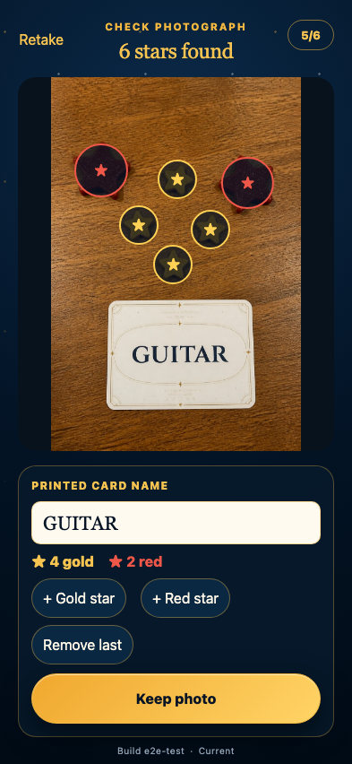

**Verifications:**

- [x] OCR reads GUITAR from the fixture rather than filename or test input
- [x] 4 small gold stars are detected
- [x] 2 larger red stars are detected
- [x] Every detected token has a positive recorded display size

## HOT AIR BALLOON is read from its printed card and its sized tokens are found

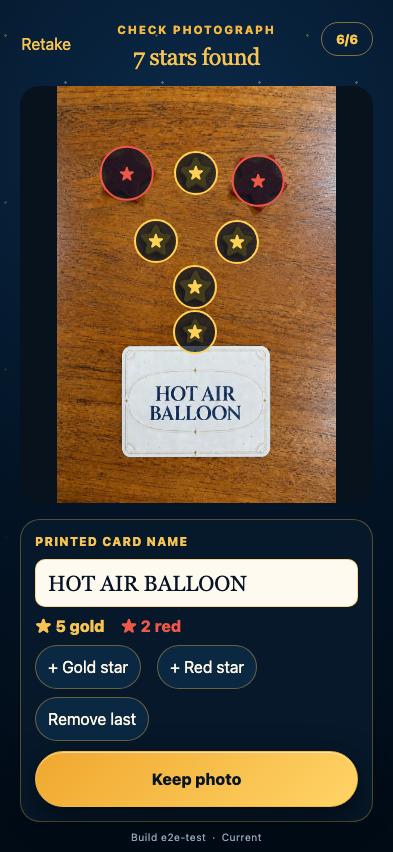

**Verifications:**

- [x] OCR reads HOT AIR BALLOON from the fixture rather than filename or test input
- [x] 5 small gold stars are detected
- [x] 2 larger red stars are detected
- [x] Every detected token has a positive recorded display size

## The complete game is reviewed before generation

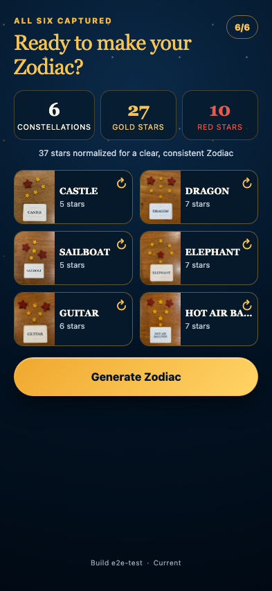

**Verifications:**

- [x] All six OCR-derived card names are present
- [x] The summary preserves all 27 gold and 10 red tokens
- [x] Generation is enabled only after six accepted captures

## The approved square Zodiac is completed entirely on device

**Verifications:**

- [x] The output is a complete 2048×2048 PNG preview
- [x] The accessible summary reports all six constellations and 37 stars
- [x] The completed output is archived as one recoverable history entry
- [x] No request leaves the application origin

## The completed keepsake survives an app reload and remains shareable

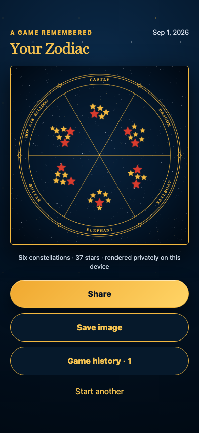

**Verifications:**

- [x] IndexedDB restores the generated Zodiac without a server
- [x] Share and save actions remain available
- [x] Restoration makes no external network request

## The completed game remains available after its active photos are cleared

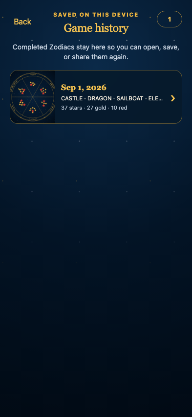

**Verifications:**

- [x] Game history contains exactly one locally saved Zodiac
- [x] The history summary retains all card labels and token totals
- [x] The saved output has a recoverable visual preview

## An old Zodiac can be recovered and shared again

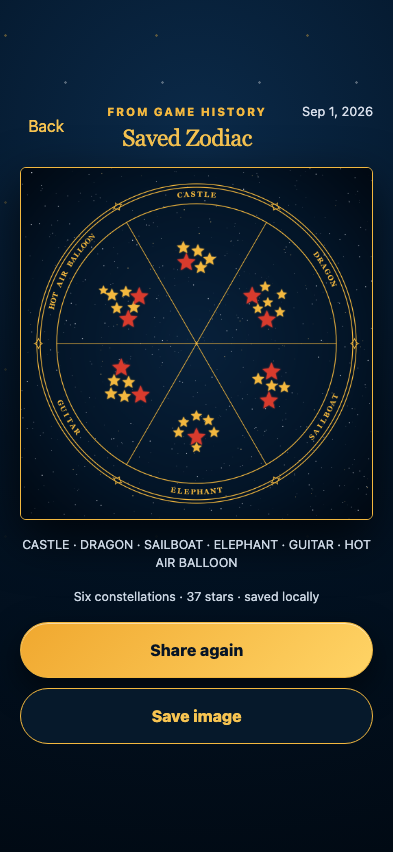

**Verifications:**

- [x] The historical output is still the original 2048×2048 PNG
- [x] History exposes explicit reshare and save actions
- [x] Recovery and history navigation make no external request
