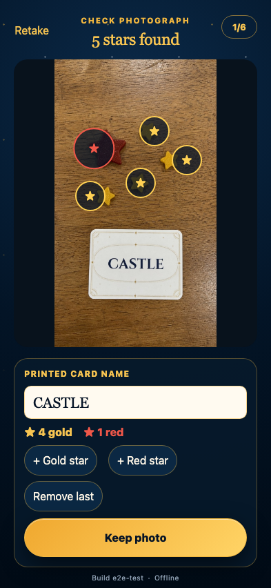

# Offline local recognition

After one online app load, the service worker supplies the complete app shell and OCR assets while a gameplay photograph is processed offline.

## The cached local pipeline reads CASTLE and all five tokens offline

**Verifications:**

- [x] The printed card name is recognized with the network disabled
- [x] Four small gold and one larger red star are detected offline
- [x] The normalized capture remains confirmable
- [x] The visible build marker distinguishes an offline freshness state
