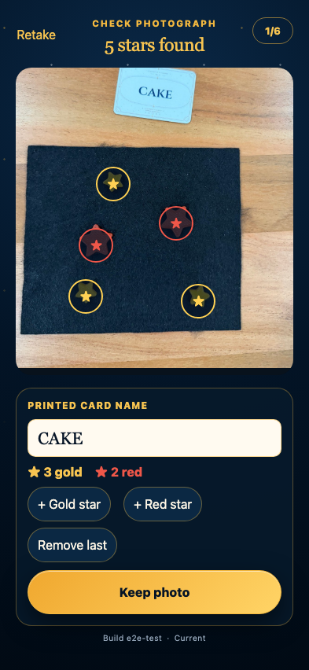

# Clipped-card OCR

A card may touch the photograph edge without losing its printed name when the word itself remains visible.

## CAKE is read even though the upper card border is outside the photograph

**Verifications:**

- [x] OCR reads the fully visible printed word
- [x] The partial card is still localized with a usable direction
- [x] All five constellation tokens remain detected
