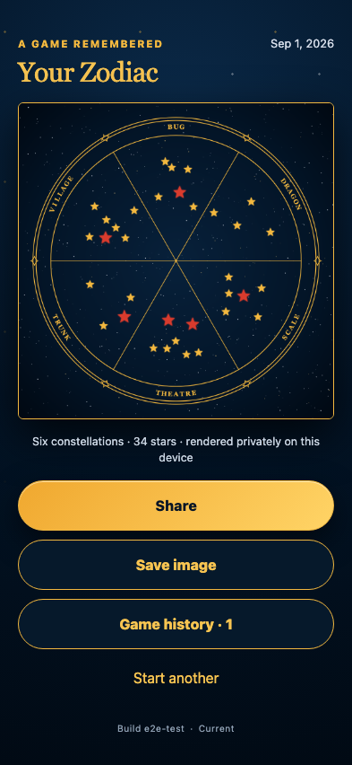

# Perspective-corrected real-photo Zodiac

Six reviewed angled gameplay photographs become a Zodiac without turning their constellation geometry into polar trapezoids.

## The six angled real photographs produce one geometry-preserving Zodiac

**Verifications:**

- [x] The output is a 2048×2048 PNG generated from the six real captures
- [x] Each accepted capture records a four-corner play surface for perspective correction
- [x] Constellation positions are composed locally without external requests
