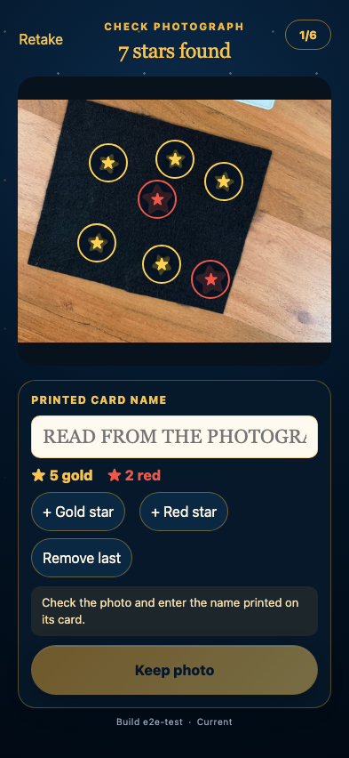

# Numbered card and die recognition

Twelve reported iPhone photographs are oriented with the card above the constellation, all six blue words are read, and the upward black-die value selects one word.

## img_0957.jpg selects PHOENIX from die 2

**Verifications:**

- [x] All six printed blue words are read in numbered order
- [x] The upward die face is 2
- [x] Only PHOENIX, without its gold number, enters the text field
- [x] The constellation retains 7 gold and 1 red tokens
- [x] Recognition remains entirely on this device

## img_0958.jpg selects CAKE from die 6

**Verifications:**

- [x] All six printed blue words are read in numbered order
- [x] The upward die face is 6
- [x] Only CAKE, without its gold number, enters the text field
- [x] The constellation retains 7 gold and 1 red tokens
- [x] Recognition remains entirely on this device

## img_0959.jpg selects VILLAGE from die 4

**Verifications:**

- [x] All six printed blue words are read in numbered order
- [x] The upward die face is 4
- [x] Only VILLAGE, without its gold number, enters the text field
- [x] The constellation retains 7 gold and 1 red tokens
- [x] Recognition remains entirely on this device

## img_0960.jpg selects WELL from die 1

**Verifications:**

- [x] All six printed blue words are read in numbered order
- [x] The upward die face is 1
- [x] Only WELL, without its gold number, enters the text field
- [x] The constellation retains 6 gold and 2 red tokens
- [x] Recognition remains entirely on this device

## img_0961.jpg selects MONSTER from die 5

**Verifications:**

- [x] All six printed blue words are read in numbered order
- [x] The upward die face is 5
- [x] Only MONSTER, without its gold number, enters the text field
- [x] The constellation retains 6 gold and 2 red tokens
- [x] Recognition remains entirely on this device

## img_0962.jpg selects JAM from die 3

**Verifications:**

- [x] All six printed blue words are read in numbered order
- [x] The upward die face is 3
- [x] Only JAM, without its gold number, enters the text field
- [x] The constellation retains 6 gold and 2 red tokens
- [x] Recognition remains entirely on this device

## img_0963.jpg selects PITCHER from die 3

**Verifications:**

- [x] All six printed blue words are read in numbered order
- [x] The upward die face is 3
- [x] Only PITCHER, without its gold number, enters the text field
- [x] The constellation retains 5 gold and 0 red tokens
- [x] Recognition remains entirely on this device

## img_0964.jpg selects RUINS from die 6

**Verifications:**

- [x] All six printed blue words are read in numbered order
- [x] The upward die face is 6
- [x] Only RUINS, without its gold number, enters the text field
- [x] The constellation retains 5 gold and 0 red tokens
- [x] Recognition remains entirely on this device

## img_0965.jpg selects CRANE from die 6

**Verifications:**

- [x] All six printed blue words are read in numbered order
- [x] The upward die face is 6
- [x] Only CRANE, without its gold number, enters the text field
- [x] The constellation retains 5 gold and 0 red tokens
- [x] Recognition remains entirely on this device

## img_0966.jpg selects CRANE from die 6

**Verifications:**

- [x] All six printed blue words are read in numbered order
- [x] The upward die face is 6
- [x] Only CRANE, without its gold number, enters the text field
- [x] The constellation retains 5 gold and 0 red tokens
- [x] Recognition remains entirely on this device

## img_0967.jpg selects BANK from die 2

**Verifications:**

- [x] All six printed blue words are read in numbered order
- [x] The upward die face is 2
- [x] Only BANK, without its gold number, enters the text field
- [x] The constellation retains 5 gold and 0 red tokens
- [x] Recognition remains entirely on this device

## img_0968.jpg selects WAVE from die 2

**Verifications:**

- [x] All six printed blue words are read in numbered order
- [x] The upward die face is 2
- [x] Only WAVE, without its gold number, enters the text field
- [x] The constellation retains 5 gold and 2 red tokens
- [x] Recognition remains entirely on this device

## A photograph without a card never invents a label

**Verifications:**

- [x] The card-name text field is empty
- [x] No six-word or die result is reported
- [x] The empty card name prevents accidental confirmation
- [x] The card-free check remains entirely local
