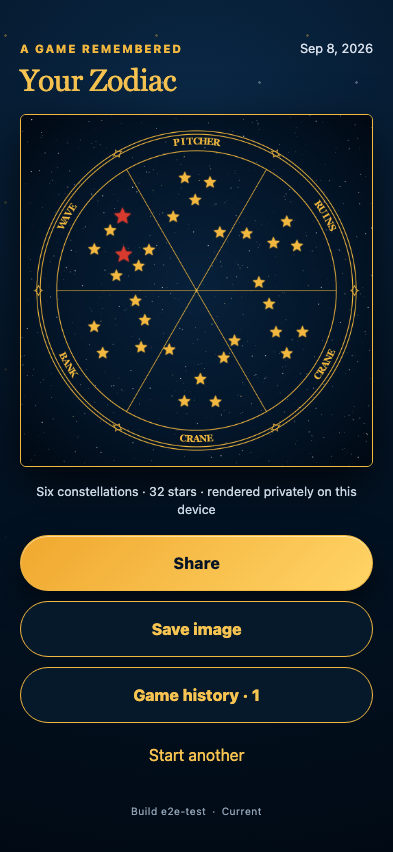

# Rotation-safe numbered-card Zodiac

Six real captures, including an exact upside-down photograph and a quarter-turn photograph, retain their card-above orientation and expand uniformly in the final Zodiac.

## Every rotated constellation fills its sector with standardized star sizes

**Verifications:**

- [x] The selected die words label all six sectors
- [x] The result is a full-resolution 2048×2048 PNG
- [x] The upside-down and quarter-turn captures both remain in the completed game
- [x] Recognition and rendering make no external request
